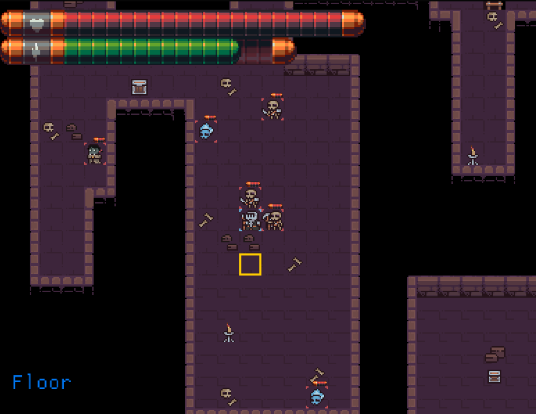

L3 game for Final project:

# Math Dungeon

Randomly generates questions to ask the user which are either polynomial questions or finding the eigenvalues of a matrix 2x2 or 3x3

## Randomly generate Loot

Use markovs chain to randomly create item names and descriptions. Most hardcode the syntaxing item decriptions structure.
Item names are generate the same way but with a simplifyed structure for them. Effect and randomly generate based of what sort of basic stat increase of health, damage. 

## Map Generation

The map generation is gross. It used a massive switch for bitmasking, to identify what tiles go where based of a number made from the surronding tiles.
Uses binary space partitioning to create the map, then create a randomly sized room in side the part space, join it to the next room.

## Art
All art is protected under CC.0.
